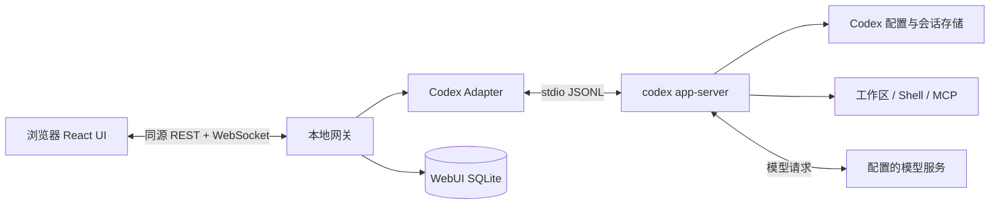
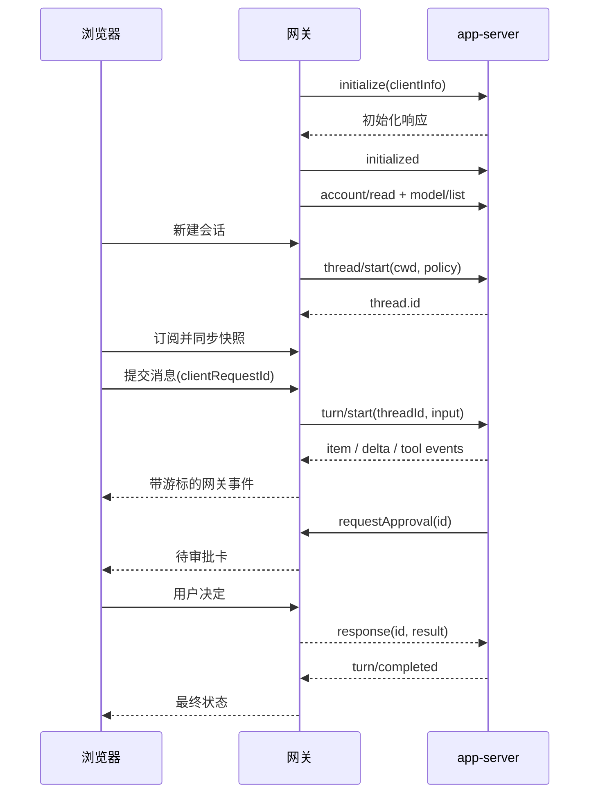

# Codex WebUI 实现文档

版本：设计草案 v0.1 · 日期：2026-09-16 · 状态：可进入技术验证阶段，尚未实现。

关联资料：[调研与源码笔记](research.md)、[本机协议核验](research/verification.json)。

## 1. 项目定位与推荐方案

构建一个本机运行、浏览器操作的 Codex 客户端：用户在项目目录启动服务，网页中完成对话、查看工具执行、处理审批、浏览文件变化、恢复历史会话。文件操作与命令执行发生在运行服务的机器上，模型请求仍由 Codex 发往其配置的服务商；“本地 WebUI”不意味着离线推理。

**推荐架构：React 网页 + Node.js 本地网关 + `codex app-server` stdio 子进程。**

Kimi 的当前 `/web` 源码采用关闭 TUI 后交接到 Web 服务的方式。本项目借鉴它的本地入口和会话交接体验，但不修改 Codex CLI，也不依赖终端输出解析。[Kimi 交接实现](https://github.com/MoonshotAI/kimi-code/blob/9c5e9b48634be1dfae921fb48f9afc3a23ffd1ad/apps/kimi-code/src/tui/commands/web.ts)。

以下除注明来源的事实外，均为本项目拟实现的设计。`codex-web`、`/api/*` 网关接口、数据库及事件封装目前都不存在，不是 Codex 自带功能。

### 1.1 假设

- 第一阶段面向个人、单用户、本机浏览器；优先 macOS，随后 Linux，Windows 单独验证进程及沙箱差异。
- 用户已安装 Codex CLI，并在终端完成登录和项目配置。
- 默认服务只处理启动时授权的一个工作区；跨工作区管理后续扩展。
- 初始兼容基线为本机已核验的 `codex-cli 0.154.0`，不把未经测试的新版本视为兼容。
- 首版不需要云服务器、额外 OpenAI API Key 或复制现有凭证；实际模型使用权限仍取决于 Codex 账号与配置。

### 1.2 为什么选这条路线

| 路线 | 适用情况 | 本项目取舍 |
| --- | --- | --- |
| PTY + 网页终端 | 快速原样展示终端交互 | 无法自然得到消息、审批、diff 等结构；不作主交互层 |
| `codex exec --json` / SDK | 任务型调用与自动化 | 可用于批处理；主交互选择更贴合富客户端的 app-server |
| app-server + 本地网关 | 长会话、事件、双向请求、审批 | 推荐；独立 adapter 吸收协议变更 |
| 直接调用模型 API | 自建 Agent 引擎 | 偏离复用 CLI 的目标，需要重做工具、权限与会话 |

官方文档将 app-server 定位为富客户端集成入口。其协议为双向 JSON-RPC 风格，stdio 采用 JSONL，wire 不携带 `jsonrpc` 字段。相关命令及部分能力仍有实验性质，必须固定版本验证。[官方 App Server 文档](https://learn.chatgpt.com/docs/app-server)。

## 2. 用户流程与功能范围

### 2.1 预期启动体验

以下是本项目未来的命令设计，不是当前可执行的安装说明：

```sh
cd /path/to/project
codex-web
codex-web --no-open
codex-web --port 4317
codex-web --resume <thread-id>
```

启动时检查 CLI 路径和版本、工作区、协议连接和登录状态；随后监听 `127.0.0.1`，输出入口并打开浏览器。默认端口 `4317`，占用时最多尝试后续 20 个端口，展示实际地址。`--no-open` 仅打印入口。Ctrl+C 走优雅关闭流程。

入口链接使用短时启动凭证，例如 `http://127.0.0.1:4317/#bootstrap=...`。浏览器交换登录态后立即清除 fragment。另提供不含凭证的普通地址，方便已登录浏览器再次访问。

### 2.2 核心旅程

1. 打开当前工作区，看到目录、模型与权限摘要。
2. 新建会话，输入“解释这个项目”或具体修改需求。
3. 文本流式显示；命令、文件修改、MCP 调用分别显示为工具卡片。
4. 需要授权时显示审批卡，用户查看范围后允许或拒绝；普通澄清问题使用问题表单。
5. 回合完成，查看回答、工具状态及本轮变更。
6. 刷新或关闭再打开网页，回到同一会话；网关仍运行时任务继续。
7. 从会话列表接续历史对话，或中断正在执行的回合。

### 2.3 优先级

| 阶段 | 能力 |
| --- | --- |
| P0 / MVP | 启动与鉴权、当前工作区会话列表、新建/恢复、文本输入、流式输出、中断、命令/文件/权限审批、问题请求、工具卡片、只读 diff、刷新恢复、错误状态 |
| P1 | 模型和推理强度选择、文件引用、图片附件、归档/重命名、历史标题搜索、多工作区、只读文件树、更多 MCP 交互 |
| P2 | 运行中 steering、隔离 worktree、多任务、完整设置界面、局域网/远程访问、可选终端面板 |

首版范围不包含多人协作、远程托管执行环境、自动提交推送、任意文件编辑器或完整复刻所有 CLI slash commands。已有 MCP 配置可能触发交互，因此 P0 至少实现通用拒绝/取消兜底，不能让未知请求永久挂起。

## 3. 界面结构

桌面采用三栏结构，右栏可收起；窄屏改为单会话视图及抽屉。

```text
┌─────────────────────────────────────────────────────────────┐
│ Codex WebUI   工作区路径   模型   权限摘要   连接状态           │
├─────────────┬──────────────────────────────┬──────────────────┤
│ 新建会话    │ 会话标题                     │ 本轮变更         │
│ 历史会话    │ 用户消息                     │ 文件列表         │
│ 标题搜索*   │ 助手输出 / 计划              │ 只读 diff        │
│             │ 命令和工具卡片               │                  │
│             │ 审批卡 / 问题表单            │                  │
│             ├──────────────────────────────┤                  │
│             │ 输入框        发送 / 停止    │                  │
└─────────────┴──────────────────────────────┴──────────────────┘
* P1
```

- 消息流以 thread / turn / item 建模；工具执行不是助手的一段普通文本。
- 正在运行时保留输入草稿，P0 禁止第二个回合发送，明确显示“任务执行中”；停止按钮始终可见。
- 审批卡显示具体命令、cwd、请求原因、权限范围或补丁；不同授权范围用明确按钮区分。
- 命令输出默认折叠，显示状态、退出码与输出截断标记；长输出可按需加载。
- “本轮变更”来自 agent 的回合信息；后续“工作区 Git 变更”另设视图，避免将用户原有修改归为 agent 的成果。
- 连接状态与回合状态分别显示。断网不等于任务取消，等待审批不等于模型仍在生成。
- Markdown 禁止原始 HTML，代码高亮延迟加载；未知 item 类型显示类型和受限的结构化详情。

## 4. 系统架构



### 4.1 职责与进程模型

| 模块 | 职责 |
| --- | --- |
| Launcher | 参数、工作区校验、版本检查、浏览器启动、信号处理 |
| Web Server | 静态资源、鉴权、API、WebSocket、请求校验 |
| Codex Adapter | 启动子进程、初始化、双向请求路由、协议类型转换 |
| Session Service | 会话所有权、单回合限制、事件投影、请求幂等 |
| Event Store | 网关事件序号、快照、恢复游标、容量控制 |
| Browser UI | 展示、输入、局部草稿、重连；不持有上游密钥 |

一个网关管理一个工作区和一个 app-server 子进程，可加载多个 thread，但 P0 全局最多运行一个回合，避免同一工作区并行修改。后续并行默认分配独立 worktree。

使用 `spawn(codexPath, ['app-server', '--listen', 'stdio://'], { shell: false, ... })`。stdout 仅解析协议，stderr 进入脱敏诊断；使用流式行解析，处理跨 chunk JSON、消息大小上限和 stdout backpressure。

工作区 cwd 和用户的 Codex 配置环境保持一致。不要复制 `auth.json`，不要把密钥或完整环境变量回传给浏览器，也不自动改写用户配置。

### 4.2 技术栈建议

- 前端：TypeScript、React、Vite；普通 CSS 或 Tailwind 二选一，优先减少依赖。
- 后端：TypeScript、Node.js 受支持的 LTS、Fastify、ws；使用 schema 校验请求。
- 本地存储：SQLite，具体驱动在 M0 验证目标 Node 与打包兼容性后锁定。
- 测试：Vitest 做协议/状态测试，Playwright 做浏览器闭环测试。
- 不需要 SSR。生产构建将前端静态资源打进同一个发布包，用户只启动一个进程入口。

这是本项目建议。Kimi 当前服务端的 Fastify、ws、Zod 依赖已通过其 [package.json](https://github.com/MoonshotAI/kimi-code/blob/9c5e9b48634be1dfae921fb48f9afc3a23ffd1ad/packages/kap-server/package.json) 核实，不能据此推断其主 Web 前端使用 React。

## 5. Codex 协议适配

### 5.1 固定协议版本

构建时从目标 CLI 生成类型和 JSON Schema，并记录 CLI 版本。生成物放在 `packages/codex-protocol/generated/`，业务层不手写一套声称完全等价的上游类型。

```sh
codex app-server generate-ts --out packages/codex-protocol/generated
codex app-server generate-json-schema --out packages/codex-protocol/schema
```

默认不启用全部实验能力。对生成类型、在线说明和实际运行存在差异的方法，加入版本能力表并实测后开放 UI。收到 method-not-found 时禁用对应功能，不转而模拟终端输入。

### 5.2 初始化与基本时序



等待初始化响应后再发 `initialized` 和业务请求，设置握手超时。不要将“子进程已启动”当成服务 ready。

下面只示意最小报文形状，实际字段由生成类型和策略适配器构造：

```json
{"id":1,"method":"initialize","params":{"clientInfo":{"name":"codex_webui","version":"0.1.0"}}}
{"method":"initialized","params":{}}
{"id":2,"method":"thread/start","params":{"cwd":"/path/to/project","approvalPolicy":"on-request","sandbox":"workspace-write"}}
{"id":3,"method":"turn/start","params":{"threadId":"thr_example","input":[{"type":"text","text":"解释这个项目"}]}}
```

这里的两项权限值只是请求示例，不表示所有环境都接受，也不表示每次写文件都必然弹框。策略必须满足上游托管限制，失败时展示原因，不静默降级为全权限。

### 5.3 功能映射

以下名称在本机 0.154.0 生成类型中核对过；可用性仍需 M0 运行测试。

| 产品能力 | 上游调用 / 事件 | 实现要点 |
| --- | --- | --- |
| 列表与历史 | `thread/list`、`thread/read` | 校验 cwd 与 source 过滤；P0 支持普通会话全历史读取 |
| 新建与恢复 | `thread/start`、`thread/resume` | 浏览历史先 read，需要继续对话时 resume |
| 发消息 | `turn/start` | 网关承担重复提交检测 |
| 中断 | `turn/interrupt` | 必须携带 threadId 和 turnId；等最终事件确认 |
| 文本流 | `item/agentMessage/delta` | 按 itemId 聚合；完成事件校正最终内容 |
| 工具流 | `item/started`、`item/completed`、`item/commandExecution/outputDelta` | 类型化卡片，正确处理失败与拒绝 |
| 计划与 diff | `turn/plan/updated`、`turn/diff/updated` | 将更新视为替换当前投影，而非盲目追加 |
| 审批清理 | `serverRequest/resolved` | 清除过期卡片，防止重复授权 |
| 后续设置 | `model/list`、`account/read` | 只输出 UI 需要的安全字段 |

分页会话是兼容性特殊情况：本机类型注释已提示全历史 hydration 对分页 thread 不再适用。P0 若遇到这种会话，显示“此会话需要分页历史支持”，禁止发送以免用户在缺失上下文展示下误操作；P1 经验证后接入实验分页 API。

### 5.4 双向请求与审批

Adapter 必须区分：有 id + method 的上游请求、有 id 的响应、没有 id 的通知。不能把审批当普通通知丢掉。

每个待响应记录包含 `serverEpoch + requestId + threadId + turnId + method + payload + status`。保留 requestId 的原始字符串/数字类型。前端只拿网关生成的 opaque approvalId，不能指定任意 RPC id。

| 请求类型 | 处理原则 |
| --- | --- |
| `item/commandExecution/requestApproval` | 展示命令或网络目标，按 `availableDecisions` 和本地支持集合呈现按钮 |
| `item/fileChange/requestApproval` | 展示文件与 patch；区分本次和会话范围授权 |
| `item/permissions/requestApproval` | 仅授予请求范围的子集；本机类型要求显式 `scope` |
| `item/tool/requestUserInput` | 按 question ID 构造 answers；不能套用 approval decision |
| `mcpServer/elicitation/request` | 支持已验证表单；不支持的格式明确拒绝/取消并解释 |
| 其他上游请求 | 按已知 schema 拒绝或返回 JSON-RPC 错误；必要时中断回合，禁止自动批准 |

命令批准的示意响应是 `{"id":42,"result":{"decision":"accept"}}`，应回到原 app-server 连接。权限审批和问题回答有不同 response schema。

两标签页同时批准时，仅第一个合法决定生效；第二个收到 `409 already_resolved`。UI 不根据点击立即标记“执行成功”，先标记“已提交”，再等上游确认。断线、超时或服务重启都不等于同意。

## 6. 会话与恢复语义

### 6.1 状态模型

分别管理两组状态：

- 连接：`starting / ready / reconnecting / unavailable`。
- 回合：`idle / submitting / running / waiting_approval / waiting_input / interrupting / completed / failed / interrupted / uncertain`。

收到中断接口成功只进入 `interrupting`；只有终止事件或对账确认才能进入 `interrupted`。子进程意外退出时进入 `uncertain`，不能把未知执行结果伪装成失败并自动重跑。

### 6.2 持久化所有权

Codex 负责权威会话历史；WebUI SQLite 保存 UI 元数据、可重建投影、有限期事件和请求去重状态。绝不直接修改 Codex 的内部 JSONL 或数据库。

建议表：

| 表 | 关键字段 |
| --- | --- |
| `workspaces` | id、canonical_path |
| `thread_views` | thread_id、workspace_id、ui_preferences、last_seen |
| `requests` | client_request_id、payload_hash、thread_id、status、turn_id、时间 |
| `event_log` | thread_id、epoch、seq、kind、payload、时间；组合唯一键 |
| `snapshots` | thread_id、epoch、through_seq、projection |
| `pending_interactions` | opaque_id、epoch、upstream_request_id、类型、状态 |

持久化 pending 记录只用于诊断和展示；旧进程已死亡时不能从数据库恢复一张仍可批准的卡。

### 6.3 浏览器刷新与短时断线

浏览器连接不拥有子进程。关闭标签页不会 kill app-server；任务在网关存活期间继续，遇到审批则等待。

网关为每个 thread 的事件分配 `(epoch, seq)`，维护投影和有界重放日志。新订阅采用同一串行事件队列生成快照与水位，先返回水位 S 的快照，再发送 `seq > S` 的事件，避免“先查历史、后订阅”丢事件。

客户端携带最后确认游标重连。epoch 一致且事件仍保留则重放，否则返回 `resync_required` 并发送新快照。客户端按组合键去重；完成 item 的最终内容覆盖临时 delta 聚合结果。

P0 建议每会话最多保留 10,000 条事件或 20 MiB，先到达者触发压缩/淘汰；这些是初始配置值，需压测校准。慢客户端达到发送缓冲上限时断开并要求重同步，不能悄悄丢弃审批和最终状态事件。

### 6.4 网关或 Codex 崩溃

新实例生成新 epoch。初始化后读取 Codex 历史并重建视图；旧 pending 全部失效。此前发送中的任务标记结果不确定，由历史和用户确认决定是否继续。

不保证重启后恢复每一条 token delta，也不保证正在执行的外部命令被撤销。UI 必须显示“执行连接已中断，部分文件或命令可能已完成”，保留已有 diff 与诊断信息供检查。

### 6.5 幂等与发送不确定性

每次发送携带 `clientRequestId`。网关先持久化 intent，再向 Codex 发请求；相同 ID 和相同内容重试返回原状态，相同 ID 不同内容返回 409。回合启动成功后记录 turnId。

如果发生“Codex 已接收，但网关还未保存响应就崩溃”，不能证明 exactly-once。恢复后将 intent 标记 `uncertain`，尝试根据历史及已知消息标识对账，无法确定则要求用户核查，禁止自动重发。`clientUserMessageId` 的存在不应被当作上游幂等保证。

### 6.6 CLI 会话接续的边界

P0 支持读取当前 cwd 下的 CLI 历史，并在原 CLI 停止使用该会话后，通过 thread ID 恢复。列表需正确设置/验证 source 与 provider 过滤。

网关锁只能限制本 WebUI 内的并发，不能可靠约束外部 CLI。首版不宣称能热接管正在运行的 TUI，也不自动杀掉它。恢复外部会话时提示用户先结束原端的活动回合。

独立项目不能直接新增官方 Codex TUI 的 `/web`。若以后一定需要该命令，应单独评估上游贡献或维护 fork；首版的等价入口是 `codex-web --resume <id>`。

## 7. 浏览器与网关 API 草案

这些是本项目 API，不是上游协议的透传。网关使用固定允许列表，校验路径、thread 归属和操作状态。

| 接口 | 作用 |
| --- | --- |
| `POST /api/auth/bootstrap` | 以一次性凭证换取浏览器会话 |
| `GET /api/status` | CLI 版本、连接、工作区、脱敏登录状态、能力列表 |
| `GET /api/threads?cursor=...` | 当前工作区会话摘要 |
| `POST /api/threads` | 创建会话，返回 threadId |
| `GET /api/threads/:id` | 获取历史/投影；检查工作区归属 |
| `POST /api/threads/:id/resume` | 恢复已停止的会话 |
| `POST /api/threads/:id/turns` | `{clientRequestId, text}`；202 表示已接受，不表示回合完成 |
| `POST /api/threads/:id/interrupt` | 中断指定活动 turnId |
| `POST /api/interactions/:id/resolve` | 类型化审批或问题回答 |
| `GET /api/requests/:clientRequestId` | 查询发送结果，解决网络超时后的重复提交 |
| `GET /api/events`（WS Upgrade） | 订阅快照、事件与重同步通知 |

HTTP 使用常规状态码：400 参数错误，401 未登录，403 越界，409 状态冲突，413 超限，429 限流，503 引擎不可用。错误体提供 `code / message / requestId`，不泄露完整环境或凭证。

网关事件示意：

```json
{
  "protocolVersion": 1,
  "type": "event",
  "threadId": "thr_example",
  "epoch": "gateway-instance-uuid",
  "seq": 105,
  "kind": "item.text.delta",
  "payload": {"turnId":"turn_example","itemId":"item_example","text":"你好"}
}
```

内部可以保留受限原始事件用于调试，对浏览器输出显式投影；禁止通用 `/rpc` 代理暴露配置写入、任意 shell、凭证等全部上游能力。

## 8. 权限与访问边界

本地服务能代表用户操作文件和命令，因此以下是实现的一部分，而非上线前再补的选项。

### 8.1 浏览器认证

- 默认仅监听 loopback，MVP 不提供 LAN 开关。
- 生成至少 256 bit 随机 bootstrap token，5 分钟过期且仅可交换一次；token 不写入普通访问日志。
- 交换成功设置 host-only、HttpOnly、SameSite=Strict 的会话 cookie，过期时间建议 8 小时；重启服务使其失效。HTTPS 环境设置 Secure，本地 HTTP 模式仍只允许 loopback。
- WebSocket upgrade 同样验证 cookie、Host 和 Origin。修改类 REST 请求要求严格同源 Origin 与 CSRF token，拒绝不匹配或缺失的浏览器来源。
- 校验 Host 允许列表以减少 DNS rebinding 风险，不启用任意 CORS。设置 CSP、frame-ancestors 和 Referrer-Policy。
- 不加载第三方统计脚本；模型输出、工具输出和路径均作为不可信内容渲染。

### 8.2 文件与工具权限

- 工作区使用 canonical realpath；API 根据保存的 workspaceId 解析路径，禁止用户直接传任意绝对路径。
- 文件查看和上传要防 `..`、符号链接逃逸和路径检查/打开之间的竞争；不能只用字符串前缀判断。MVP 不提供任意文件读取端点。
- 网关自身的文件/Git 操作不会自动经过 Codex 沙箱，必须另外限制；不要在网关写一个通用 shell 执行接口。
- 保留 Codex 的审批和托管策略；默认不开放 `danger-full-access` 或跳过审批按钮。界面不能保证每次写入都会触发审批，只展示实际生效策略。
- 持久数据目录限当前用户访问。调试日志默认只保存方法、状态和耗时；导出会话内容需用户主动操作。

未来远程访问另做 HTTPS、身份认证、会话隔离设计。浏览器永远不直接连接裸 app-server WebSocket；P0 的 stdio 连接不对网络开放。

## 9. 工程结构与分发

```text
apps/
  web/                     # React UI
  server/                  # 本地网关、REST、WS
packages/
  launcher/                # codex-web 入口
  codex-adapter/           # stdio RPC、能力表、请求映射
  codex-protocol/          # 固定版本生成类型/schema
  shared/                 # 网关 API 与事件 schema
  persistence/            # SQLite、迁移、快照
tests/
  fixtures/               # 脱敏协议录制与故障场景
  integration/
  e2e/
docs/
```

开发时 Vite 将 `/api` 和 WS 代理到本地网关，避免生产环境引入跨域需求。发布前构建 SPA，由 server 同源提供；未知 API 返回 JSON 404，前端会话路由回退到入口页。

启动时验证 Codex 版本是否属于经过测试的列表。未经测试版本显示诊断并默认阻止执行任务；允许开发者显式进入兼容性验证模式。升级时生成协议 diff，补充 fixtures，跑兼容测试后再更新列表。

## 10. 分阶段实施

工作量为一名熟悉 TypeScript 的开发者的初步估算，不是交付承诺；协议兼容与崩溃语义是最大不确定项。

| 阶段 | 交付 | 完成标准 | 估算 |
| --- | --- | --- | --- |
| M0 技术验证 | 无 UI 的 adapter 验证器、固定协议、最小测试记录 | 真机完成初始化、流式回合、中断、审批、历史接续；明确哪些能力不可用 | 1–2 天 |
| M1 垂直闭环 | 启动器、认证、单工作区、新建/恢复、聊天和停止 | 浏览器实际驱动 Codex，退出能清理资源 | 2–3 天 |
| M2 完整交互 | 工具、审批/问题、计划、只读 diff | 拒绝也能正常结束；多标签页无重复响应 | 2–3 天 |
| M3 恢复与交付 | 快照/重放、请求去重、异常状态、打包 | 刷新/断网/崩溃测试通过，一条命令启动 | 2–4 天 |
| M4 后续体验 | P1 功能与跨平台验证 | 按独立需求逐项验收 | 另行估算 |

M0 是继续 UI 开发的门槛：如果本机策略使关键审批无法通过 app-server 完成，先解决 adapter/版本问题，不用默认全权限绕过。先用测试工作区做模型调用，避免拿真实工作项目作为故障测试场地。

## 11. 验收与测试

### 11.1 发布前必过场景

| 场景 | 预期结果 |
| --- | --- |
| 首次启动/端口占用 | 打开有效入口；按范围换端口；无 CLI/未登录有清楚引导 |
| 普通对话 | 持续输出，最终内容与上游完成事件一致 |
| 命令与文件审批 | 允许/拒绝正确回传；取消不被当作允许 |
| 权限与问题表单 | 按各自 schema 回答，未知类型不自动批准 |
| 执行中刷新 | 任务保持运行，快照恢复工具和审批状态 |
| 两标签页同时响应 | 仅一次上游响应，另一端显示已处理 |
| 发送请求超时后重试 | 相同 clientRequestId 不重复启动任务 |
| 点击停止 | 指定回合收到中断，最终状态不是假完成 |
| app-server 意外退出 | UI 显示不确定状态；旧审批失效；不自动重跑 |
| 大量工具输出 | 内存有上限，滚动可用，截断有提示 |
| CLI 历史接续 | 在原端停止后保持 thread ID 和历史，cwd 正确 |
| 未认证 REST / WS | 均拒绝；恶意 Origin/Host 也拒绝 |
| Markdown/XSS 与越界路径 | 不执行注入代码，不越权读取 |
| Ctrl+C | 停止接单、尽力中断、关闭连接与数据库、回收子进程；超时给出诊断 |

### 11.2 测试分层

- 协议单测：分块 JSONL、请求/响应 ID 路由、未知事件、审批响应 schema、进程退出后的 pending 清理。
- 状态测试：快照与事件水位一致性、重复 delta、迟到 completion、重放缺口、发送不确定窗口。
- 集成测试：伪 app-server 可精确制造故障；真实 CLI 在独立工作区验证核心能力和版本兼容。
- 浏览器测试：登录、消息、审批、刷新、两标签页、diff、恶意渲染输入。
- 资源测试：模拟 10,000 条事件与长输出，检查缓冲与存储上限；渲染延迟目标在测试机器上单独记录，不把模型响应时延算作 UI 延迟。

## 12. 已知限制与下一步

本次完成了官方资料阅读、Kimi 固定版本源码分析、Codex CLI 版本与生成类型核验；没有实现或运行 WebUI，也没有执行真实模型回合。

当前最需要验证的是：现有 CLI 历史是否按预期恢复、实际审批请求是否完整、分页历史兼容、网关重启后的不确定回合处理。建议下一步直接实施 M0，再据结果收敛 M1 接口。

首版的成功标准是：用户在项目目录启动一次，在浏览器完成一次真实 Codex 工作流，能够审批、中断、查看变化，并在刷新后继续看到正确状态。
